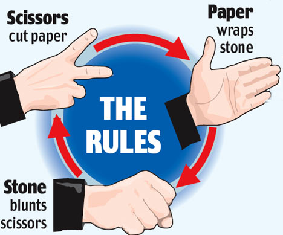
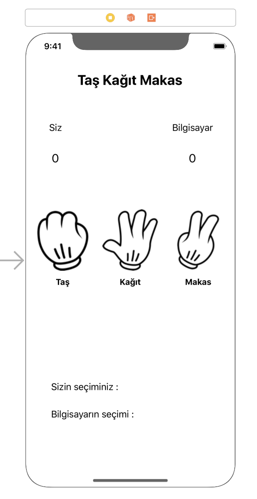
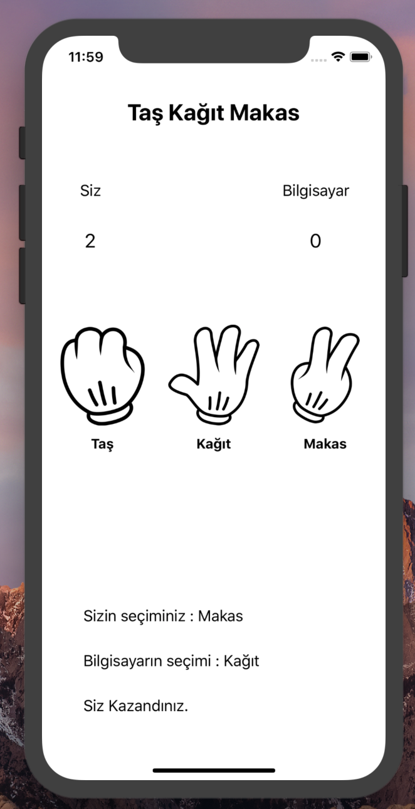
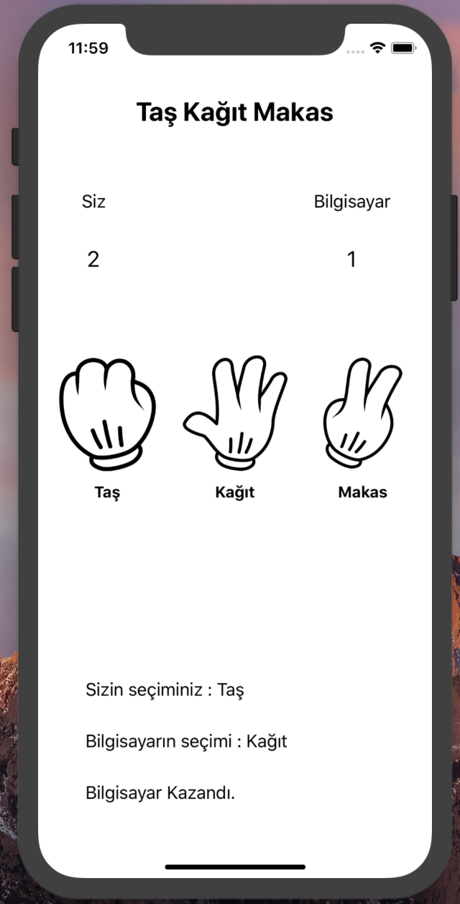
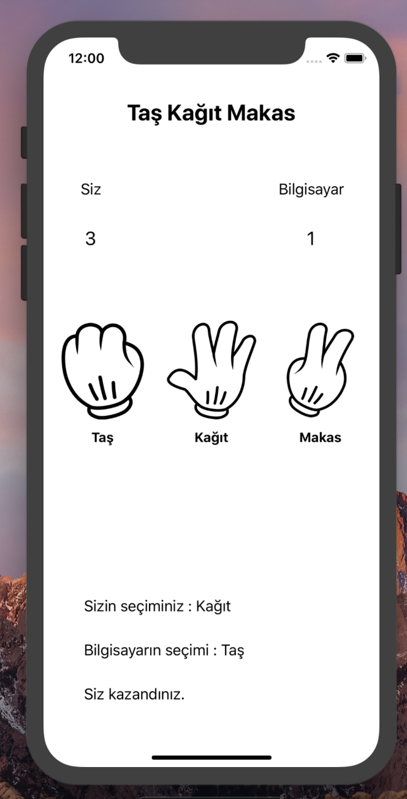

# Rock 🪨 Paper 📃 Scissors ✂️ Game 🏆



## The goal of the project 🌎

Rock Paper Scissors game is an iOS application developed with Swift-5.
The aim is to show the user how to play in a simple way in iOS applications.

## Project Content ℹ️
It is a project developed with Swift 5.5 You will learn the usage of components such as Button, Image, Label. <br>

## How to Play the Game ⁉️
There are 2 competitors in the game, a user and a computer. Our opponent is random according to our choice
it waits for its result against us by offering a choice. If he uses a good employee from us, he gets 1 point. If we win
our score increases by 1. If it is equal, the game continues without changing anything. The states of the structures relative to each other
is as follows:

1. Rock - Paper: Paper
2. Rock - Scissors: Stone
3. Rock - Rock: Draw
4. Paper - Paper: Draw
5. Paper - Scissors: Scissors
6. Paper - Rock: Paper
7. Scissors - Paper: Scissors
8. Scissors - Scissors: Draw
9. Scissors - Rock: Stone

 <br>

## Screen Design 📱

<p>
  
</p>

We used various structures in screen design. 3 buttons were used. Other remaining structures are label elements.
It was designed with a label, with fields where values are updated in cases of gain or loss.
You can find the pictures used in the background of the buttons in the following file:

https://github.com/halilozel1903/StonePaperScissorsGame/tree/master/TasKagitMakas/TasKagitMakas/Assets.xcassets

We are now linking the designed codes in the ```ViewController.swift``` file:

```java 
  // MARK: - Variables 
  // MARK: - IBOutlets
  // MARK: - IBActions
```
 We are editing the codes we have written with a new usage style. Defined structures are variables, definitions
 and button operations. We will be able to navigate easily within the project as follows:
 
 <p>
  
</p>

<br>

## Writing the Codes 💻


```swift 
// MARK: - Variables
    var myPoints = 0
    var pcPoints = 0
    let array = ["rock","paper","scissors"] // An array of string type was created.
```
Two variables were defined to keep the user's score and the computer's score. 0 is assigned to their initial value.
An array of type string has been defined. The options used in the game have been added into the Array.

<br>

```swift 
 // MARK: - IBOutlets
    @IBOutlet weak var myChoiseLabel: UILabel!
    @IBOutlet weak var pcChoiseLabel: UILabel!
    @IBOutlet weak var theEndLabel: UILabel!
    @IBOutlet weak var myPointsLabel: UILabel!
    @IBOutlet weak var pcPointsLabel: UILabel!
```

We defined the Labels in the design with code. Labels showing the points obtained by the user and the computer,
a label indicating who is the winner and a label describing who won according to the total result.

<br>

Now we will write 3 methods to define the operations that will occur when the buttons are clicked. Their functions are similar.

```swift 
@IBAction func rockSelected(_ sender: Any) {
        
        let randomSelected = Int(arc4random_uniform(3)) // 0,1,2
        let pcSelected = array[randomSelected] // random element will be taken from the array.
        
        if pcSelected == "rock" {
            myChoiseLabel.text = "Your Choice : Rock"
            pcChoiseLabel.text = "Computer Choice : Rock"
            theEndLabel.text = "Tie."
            
            
        }else if pcSelected == "paper" {
            myChoiseLabel.text = "Your Choice : Rock"
            pcChoiseLabel.text = "Computer Choice : Paper"
            theEndLabel.text = "Computer won."
            
            pcPoints += 1
            
            pcPointsLabel.text = String(pcPoints)
            
        }else if pcSelected == "scissors" {
            myChoiseLabel.text = "Your Choice : Rock"
            pcChoiseLabel.text = "Computer Choice : Scissors"
            theEndLabel.text = "You won"
            
            myPoints += 1
            
            myPointsLabel.text = String(myPoints)
            
        }
    }
```

We generate a random number between 0-2 using the random number generator function. This generated value is assigned to the value of array.
Then the comparison is made. If the computer selects the "stone" option, a stone will be written on the selected part of the screen. As a result, because we chose stones, the result is a draw. If we choose stone and paper on the computer, the computer wins the game and gets 1 point. The message on the screen shows the computer won. If we are stone and computer scissors, we win and our score increases by 1 and the screen says you won.

 <br>

```swift 

 // paper handling
    @IBAction func paperSelected(_ sender: Any) {
        
        let randomSelected = Int(arc4random_uniform(3)) // 0,1,2
        let pcSelected = array[randomSelected] // random element will be taken from the array.
        
        if pcSelected == "rock" {
            myChoiseLabel.text = "Your Choice : Paper"
            pcChoiseLabel.text = "Computer Choice : Rock"
            theEndLabel.text = "You won."
            
            myPoints += 1
            
            myPointsLabel.text = String(myPoints)
            
            
        }else if pcSelected == "paper" {
            myChoiseLabel.text = "Your Choice : Paper"
            pcChoiseLabel.text = "Computer Choice : Paper"
            theEndLabel.text = "Tie."
            
        
            
        }else if pcSelected == "scissors" {
            myChoiseLabel.text = "Your Choice : Paper"
            pcChoiseLabel.text = "Computer Choice : Scissors"
            theEndLabel.text = "Computer won."
            
            pcPoints += 1
            
            pcPointsLabel.text = String(pcPoints)
            
        }
        
    }

```

This time, we become paper in our choices. The status of the paper compared to other components is checked. Much to the stone method
This similar method performs the desired operations with only a slight change.

 <br>

```swift 

// scissors related operations
    @IBAction func scissorSelected(_ sender: Any) {
        
        let randomSelected = Int(arc4random_uniform(3)) // 0,1,2
        let pcSelected = array[randomSelected] // random element will be taken from the array.
        
        if pcSelected == "rock" {
            myChoiseLabel.text = "Your Choice  : Rock"
            pcChoiseLabel.text = "Bilgisayarın seçimi : Taş"
            theEndLabel.text = "Computer won."
            
            pcPoints += 1
            
            pcPointsLabel.text = String(pcPoints)
            
            
        }else if pcSelected == "paper" {
            myChoiseLabel.text = "Your Choice  : scissors"
            pcChoiseLabel.text = "Computer Choice : Paper"
            theEndLabel.text = "You won."
            
            myPoints += 1
            
            myPointsLabel.text = String(myPoints)
           
            
        }else if pcSelected == "scissors" {
            myChoiseLabel.text = "Your Choice  : scissors"
            pcChoiseLabel.text = "Computer Choice : scissors"
            theEndLabel.text = "Tie"
           
            
        }
        
    }

```

We have created a method to do the latest scissors related operations. If the scissors prevail, our score will increase by 1 if
If the value of the computer wins, the value of the computer will increase by 1. The result will not change if we have equal options.

 <br>

## Application Demo 📸


    

     

 <br>
 
 ## Donation 💸

If this project help 💁 you to develop, you can give me a cup of coffee. ☕

[](https://www.buymeacoffee.com/halilozel1903)

## License 📚
```
MIT License

Copyright (c) 2023 Halil OZEL

Permission is hereby granted, free of charge, to any person obtaining a copy
of this software and associated documentation files (the "Software"), to deal
in the Software without restriction, including without limitation the rights
to use, copy, modify, merge, publish, distribute, sublicense, and/or sell
copies of the Software, and to permit persons to whom the Software is
furnished to do so, subject to the following conditions:

The above copyright notice and this permission notice shall be included in all
copies or substantial portions of the Software.

THE SOFTWARE IS PROVIDED "AS IS", WITHOUT WARRANTY OF ANY KIND, EXPRESS OR
IMPLIED, INCLUDING BUT NOT LIMITED TO THE WARRANTIES OF MERCHANTABILITY,
FITNESS FOR A PARTICULAR PURPOSE AND NONINFRINGEMENT. IN NO EVENT SHALL THE
AUTHORS OR COPYRIGHT HOLDERS BE LIABLE FOR ANY CLAIM, DAMAGES OR OTHER
LIABILITY, WHETHER IN AN ACTION OF CONTRACT, TORT OR OTHERWISE, ARISING FROM,
OUT OF OR IN CONNECTION WITH THE SOFTWARE OR THE USE OR OTHER DEALINGS IN THE
SOFTWARE.
```
