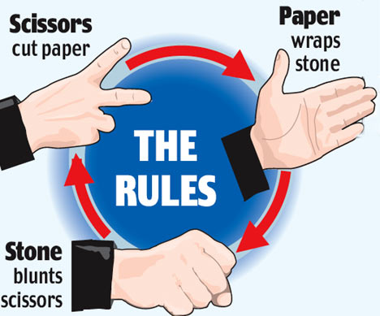
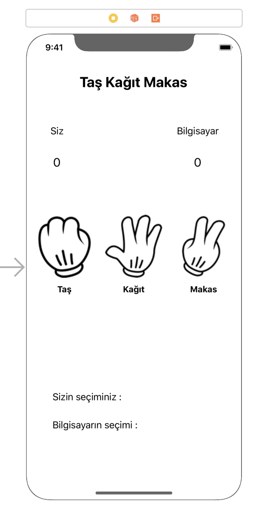
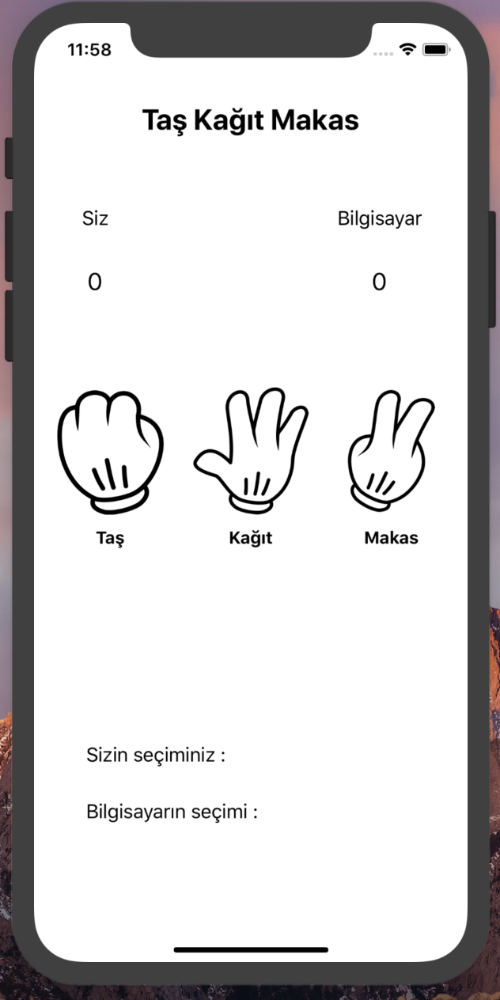
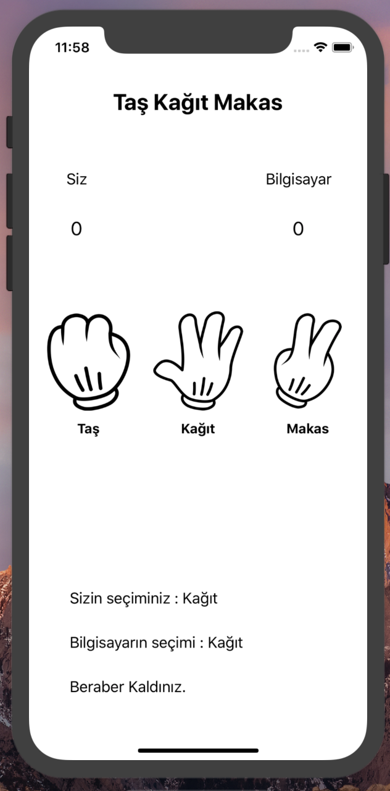
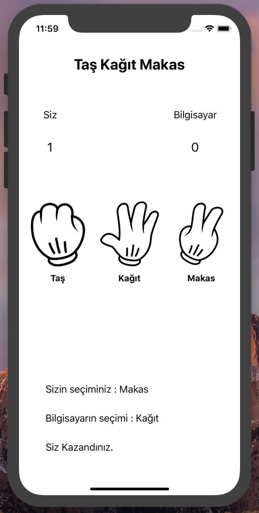
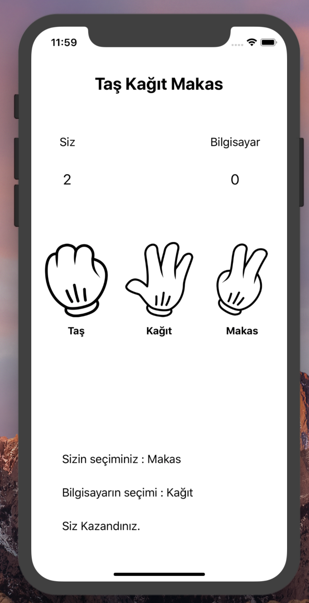
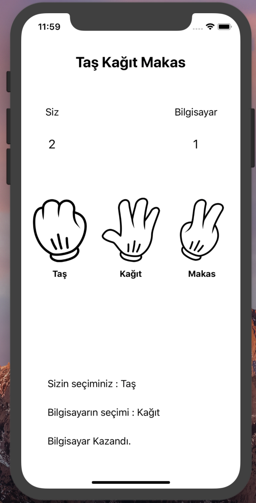

# Rock Paper Scissors

<p align="center">
  
</p>

<p align="center">
  
  
  
  
  
</p>

<p align="center">
  
  
  
  
  
</p>

iOS UIKit game where you play rock, paper, scissors against the computer in first-to-five matches.

**About:** `iOS Rock Paper Scissors game in Swift and UIKit. First-to-five matches, win streaks, and a resettable scoreboard.`

Suggested GitHub topics: `ios`, `swift`, `uikit`, `ios-game`, `rock-paper-scissors`, `mobile-game`

## Highlights

- Player vs computer with random computer moves
- Shared `GameRules` resolver instead of duplicated button logic
- First player to 5 points wins the match
- Current streak and best streak on the scoreboard
- Match lock after a winner, plus **Maçı Sıfırla** to start again

## How to play

Pick **Taş**, **Kağıt**, or **Makas**. The computer picks at the same time.

| You | Computer | Result |
| --- | --- | --- |
| Rock | Scissors | You win |
| Paper | Rock | You win |
| Scissors | Paper | You win |
| Same move | Same move | Draw |
| Anything else | Counter | Computer wins |

A win adds 1 point and grows your streak. A loss resets the streak. Draws leave the score unchanged. The first side to 5 points takes the match.

## Architecture

```text
ViewController  →  GameRules.playRound(player, computer)
     UI                    Move / RoundOutcome
```

| File | Role |
| --- | --- |
| `ViewController.swift` | Buttons, scoreboard, match chrome, reset |
| `GameRules.swift` | Moves, win conditions, first-to-five constant |

Open `TasKagitMakas/TasKagitMakas.xcodeproj` in Xcode and run the **TasKagitMakas** scheme.

## Screenshots

<p>
  
  
  
</p>

<p>
  
  
  
</p>

## License

MIT © Halil OZEL. See the license text below.

<details>
<summary>MIT License</summary>

```
MIT License

Copyright (c) 2023 Halil OZEL

Permission is hereby granted, free of charge, to any person obtaining a copy
of this software and associated documentation files (the "Software"), to deal
in the Software without restriction, including without limitation the rights
to use, copy, modify, merge, publish, distribute, sublicense, and/or sell
copies of the Software, and to permit persons to whom the Software is
furnished to do so, subject to the following conditions:

The above copyright notice and this permission notice shall be included in all
copies or substantial portions of the Software.

THE SOFTWARE IS PROVIDED "AS IS", WITHOUT WARRANTY OF ANY KIND, EXPRESS OR
IMPLIED, INCLUDING BUT NOT LIMITED TO THE WARRANTIES OF MERCHANTABILITY,
FITNESS FOR A PARTICULAR PURPOSE AND NONINFRINGEMENT. IN NO EVENT SHALL THE
AUTHORS OR COPYRIGHT HOLDERS BE LIABLE FOR ANY CLAIM, DAMAGES OR OTHER
LIABILITY, WHETHER IN AN ACTION OF CONTRACT, TORT OR OTHERWISE, ARISING FROM,
OUT OF OR IN CONNECTION WITH THE SOFTWARE OR THE USE OR OTHER DEALINGS IN THE
SOFTWARE.
```

</details>
